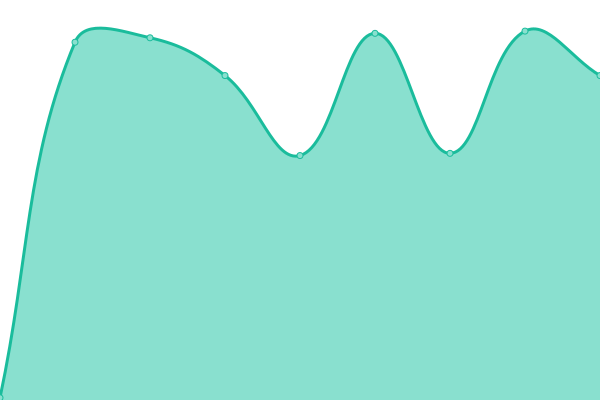

# [📈 Live Status](https://tsukuba-hpcs.github.io/upptime): <!--live status--> **🟧 Partial outage**

This repository contains the open-source uptime monitor and status page for [HPCS Lab](https://www.hpcs.cs.tsukuba.ac.jp/), powered by [Upptime](https://github.com/upptime/upptime).

With [Upptime](https://upptime.js.org), you can get your own unlimited and free uptime monitor and status page, powered entirely by a GitHub repository. We use [Issues](https://github.com/tsukuba-hpcs/upptime/issues) as incident reports, [Actions](https://github.com/tsukuba-hpcs/upptime/actions) as uptime monitors, and [Pages](https://tsukuba-hpcs.github.io/upptime) for the status page.

<!--start: status pages-->
<!-- This summary is generated by Upptime (https://github.com/upptime/upptime) -->
<!-- Do not edit this manually, your changes will be overwritten -->
<!-- prettier-ignore -->
| URL | Status | History | Response Time | Uptime |
| --- | ------ | ------- | ------------- | ------ |
|  [DNS Primary](ns.omni.hpcc.jp) | 🟩 Up | [dns-primary.yml](https://github.com/tsukuba-hpcs/upptime/commits/HEAD/history/dns-primary.yml) | 

 150ms
     
 | 

<a href="https://tsukuba-hpcs.github.io/upptime/history/dns-primary">47.76%</a>
    

|  [DNS Secondary](fs.omni.hpcc.jp) | 🟥 Down | [dns-secondary.yml](https://github.com/tsukuba-hpcs/upptime/commits/HEAD/history/dns-secondary.yml) | 

 157ms
     
 | 

<a href="https://tsukuba-hpcs.github.io/upptime/history/dns-secondary">52.50%</a>
    

|  [Gateway (SSH)](gw.omni.hpcc.jp) | 🟩 Up | [gateway-ssh.yml](https://github.com/tsukuba-hpcs/upptime/commits/HEAD/history/gateway-ssh.yml) | 

 151ms
     
 | 

<a href="https://tsukuba-hpcs.github.io/upptime/history/gateway-ssh">47.76%</a>
    

|  [fern01](fern01.omni.hpcc.jp) | 🟩 Up | [fern01.yml](https://github.com/tsukuba-hpcs/upptime/commits/HEAD/history/fern01.yml) | 

 150ms
     
 | 

<a href="https://tsukuba-hpcs.github.io/upptime/history/fern01">47.76%</a>
    

|  [fern02](fern02.omni.hpcc.jp) | 🟩 Up | [fern02.yml](https://github.com/tsukuba-hpcs/upptime/commits/HEAD/history/fern02.yml) | 

 149ms
     
 | 

<a href="https://tsukuba-hpcs.github.io/upptime/history/fern02">47.76%</a>
    

|  [chris00](chris00.omni.hpcc.jp) | 🟩 Up | [chris00.yml](https://github.com/tsukuba-hpcs/upptime/commits/HEAD/history/chris00.yml) | 

 150ms
     
 | 

<a href="https://tsukuba-hpcs.github.io/upptime/history/chris00">47.76%</a>
    

|  [chris01](chris01.omni.hpcc.jp) | 🟩 Up | [chris01.yml](https://github.com/tsukuba-hpcs/upptime/commits/HEAD/history/chris01.yml) | 

 149ms
     
 | 

<a href="https://tsukuba-hpcs.github.io/upptime/history/chris01">47.76%</a>
    

|  [chris02](chris02.omni.hpcc.jp) | 🟩 Up | [chris02.yml](https://github.com/tsukuba-hpcs/upptime/commits/HEAD/history/chris02.yml) | 

 150ms
     
 | 

<a href="https://tsukuba-hpcs.github.io/upptime/history/chris02">47.76%</a>
    

|  [chris03](chris03.omni.hpcc.jp) | 🟩 Up | [chris03.yml](https://github.com/tsukuba-hpcs/upptime/commits/HEAD/history/chris03.yml) | 

 150ms
     
 | 

<a href="https://tsukuba-hpcs.github.io/upptime/history/chris03">47.76%</a>
    

|  [chris04](chris04.omni.hpcc.jp) | 🟩 Up | [chris04.yml](https://github.com/tsukuba-hpcs/upptime/commits/HEAD/history/chris04.yml) | 

 150ms
     
 | 

<a href="https://tsukuba-hpcs.github.io/upptime/history/chris04">47.76%</a>
    

|  [chris05](chris05.omni.hpcc.jp) | 🟩 Up | [chris05.yml](https://github.com/tsukuba-hpcs/upptime/commits/HEAD/history/chris05.yml) | 

 144ms
     
 | 

<a href="https://tsukuba-hpcs.github.io/upptime/history/chris05">100.00%</a>
    

|  [chris06](chris06.omni.hpcc.jp) | 🟩 Up | [chris06.yml](https://github.com/tsukuba-hpcs/upptime/commits/HEAD/history/chris06.yml) | 

 150ms
     
 | 

<a href="https://tsukuba-hpcs.github.io/upptime/history/chris06">47.76%</a>
    

|  [chris07](chris07.omni.hpcc.jp) | 🟩 Up | [chris07.yml](https://github.com/tsukuba-hpcs/upptime/commits/HEAD/history/chris07.yml) | 

 144ms
     
 | 

<a href="https://tsukuba-hpcs.github.io/upptime/history/chris07">100.00%</a>
    

|  [chris08](chris08.omni.hpcc.jp) | 🟩 Up | [chris08.yml](https://github.com/tsukuba-hpcs/upptime/commits/HEAD/history/chris08.yml) | 

 144ms
     
 | 

<a href="https://tsukuba-hpcs.github.io/upptime/history/chris08">47.77%</a>
    

|  [chris09](chris09.omni.hpcc.jp) | 🟩 Up | [chris09.yml](https://github.com/tsukuba-hpcs/upptime/commits/HEAD/history/chris09.yml) | 

 151ms
     
 | 

<a href="https://tsukuba-hpcs.github.io/upptime/history/chris09">100.00%</a>
    

|  [chris10](chris10.omni.hpcc.jp) | 🟩 Up | [chris10.yml](https://github.com/tsukuba-hpcs/upptime/commits/HEAD/history/chris10.yml) | 

 150ms
     
 | 

<a href="https://tsukuba-hpcs.github.io/upptime/history/chris10">100.00%</a>
    

|  [chris11](chris11.omni.hpcc.jp) | 🟩 Up | [chris11.yml](https://github.com/tsukuba-hpcs/upptime/commits/HEAD/history/chris11.yml) | 

 150ms
     
 | 

<a href="https://tsukuba-hpcs.github.io/upptime/history/chris11">100.00%</a>
    

|  [chris20](chris20.omni.hpcc.jp) | 🟩 Up | [chris20.yml](https://github.com/tsukuba-hpcs/upptime/commits/HEAD/history/chris20.yml) | 

 148ms
     
 | 

<a href="https://tsukuba-hpcs.github.io/upptime/history/chris20">71.34%</a>
    

|  [chris21](chris21.omni.hpcc.jp) | 🟩 Up | [chris21.yml](https://github.com/tsukuba-hpcs/upptime/commits/HEAD/history/chris21.yml) | 

 150ms
     
 | 

<a href="https://tsukuba-hpcs.github.io/upptime/history/chris21">100.00%</a>
    

|  [chris22](chris22.omni.hpcc.jp) | 🟩 Up | [chris22.yml](https://github.com/tsukuba-hpcs/upptime/commits/HEAD/history/chris22.yml) | 

 151ms
     
 | 

<a href="https://tsukuba-hpcs.github.io/upptime/history/chris22">100.00%</a>
    

|  [chris23](chris23.omni.hpcc.jp) | 🟩 Up | [chris23.yml](https://github.com/tsukuba-hpcs/upptime/commits/HEAD/history/chris23.yml) | 

 144ms
     
 | 

<a href="https://tsukuba-hpcs.github.io/upptime/history/chris23">100.00%</a>
    

|  [chris24](chris24.omni.hpcc.jp) | 🟩 Up | [chris24.yml](https://github.com/tsukuba-hpcs/upptime/commits/HEAD/history/chris24.yml) | 

 149ms
     
 | 

<a href="https://tsukuba-hpcs.github.io/upptime/history/chris24">100.00%</a>
    

|  [chris25](chris25.omni.hpcc.jp) | 🟩 Up | [chris25.yml](https://github.com/tsukuba-hpcs/upptime/commits/HEAD/history/chris25.yml) | 

 150ms
     
 | 

<a href="https://tsukuba-hpcs.github.io/upptime/history/chris25">100.00%</a>
    

|  [chris26](chris26.omni.hpcc.jp) | 🟥 Down | [chris26.yml](https://github.com/tsukuba-hpcs/upptime/commits/HEAD/history/chris26.yml) | 

 151ms
     
 | 

<a href="https://tsukuba-hpcs.github.io/upptime/history/chris26">95.57%</a>
    

|  [chris30](chris30.omni.hpcc.jp) | 🟩 Up | [chris30.yml](https://github.com/tsukuba-hpcs/upptime/commits/HEAD/history/chris30.yml) | 

 150ms
     
 | 

<a href="https://tsukuba-hpcs.github.io/upptime/history/chris30">100.00%</a>
    

|  [chris40](chris40.omni.hpcc.jp) | 🟩 Up | [chris40.yml](https://github.com/tsukuba-hpcs/upptime/commits/HEAD/history/chris40.yml) | 

 151ms
     
 | 

<a href="https://tsukuba-hpcs.github.io/upptime/history/chris40">100.00%</a>
    

|  [chris41](chris41.omni.hpcc.jp) | 🟩 Up | [chris41.yml](https://github.com/tsukuba-hpcs/upptime/commits/HEAD/history/chris41.yml) | 

 150ms
     
 | 

<a href="https://tsukuba-hpcs.github.io/upptime/history/chris41">100.00%</a>
    

|  [chris42](chris42.omni.hpcc.jp) | 🟩 Up | [chris42.yml](https://github.com/tsukuba-hpcs/upptime/commits/HEAD/history/chris42.yml) | 

 150ms
     
 | 

<a href="https://tsukuba-hpcs.github.io/upptime/history/chris42">100.00%</a>
    

|  [chris43](chris43.omni.hpcc.jp) | 🟩 Up | [chris43.yml](https://github.com/tsukuba-hpcs/upptime/commits/HEAD/history/chris43.yml) | 

 150ms
     
 | 

<a href="https://tsukuba-hpcs.github.io/upptime/history/chris43">100.00%</a>
    

|  [chris44](chris44.omni.hpcc.jp) | 🟩 Up | [chris44.yml](https://github.com/tsukuba-hpcs/upptime/commits/HEAD/history/chris44.yml) | 

 150ms
     
 | 

<a href="https://tsukuba-hpcs.github.io/upptime/history/chris44">100.00%</a>
    

|  [chris50](chris50.omni.hpcc.jp) | 🟩 Up | [chris50.yml](https://github.com/tsukuba-hpcs/upptime/commits/HEAD/history/chris50.yml) | 

 150ms
     
 | 

<a href="https://tsukuba-hpcs.github.io/upptime/history/chris50">100.00%</a>
    

|  [chris60](chris60.omni.hpcc.jp) | 🟩 Up | [chris60.yml](https://github.com/tsukuba-hpcs/upptime/commits/HEAD/history/chris60.yml) | 

 151ms
     
 | 

<a href="https://tsukuba-hpcs.github.io/upptime/history/chris60">100.00%</a>
    

|  [chris61](chris61.omni.hpcc.jp) | 🟩 Up | [chris61.yml](https://github.com/tsukuba-hpcs/upptime/commits/HEAD/history/chris61.yml) | 

 151ms
     
 | 

<a href="https://tsukuba-hpcs.github.io/upptime/history/chris61">100.00%</a>
    

|  [chris80](chris80.omni.hpcc.jp) | 🟩 Up | [chris80.yml](https://github.com/tsukuba-hpcs/upptime/commits/HEAD/history/chris80.yml) | 

 150ms
     
 | 

<a href="https://tsukuba-hpcs.github.io/upptime/history/chris80">100.00%</a>
    

|  [chris81](chris81.omni.hpcc.jp) | 🟩 Up | [chris81.yml](https://github.com/tsukuba-hpcs/upptime/commits/HEAD/history/chris81.yml) | 

 149ms
     
 | 

<a href="https://tsukuba-hpcs.github.io/upptime/history/chris81">100.00%</a>
    

|  [chris82](chris82.omni.hpcc.jp) | 🟩 Up | [chris82.yml](https://github.com/tsukuba-hpcs/upptime/commits/HEAD/history/chris82.yml) | 

 151ms
     
 | 

<a href="https://tsukuba-hpcs.github.io/upptime/history/chris82">100.00%</a>
    

|  [chris83](chris83.omni.hpcc.jp) | 🟩 Up | [chris83.yml](https://github.com/tsukuba-hpcs/upptime/commits/HEAD/history/chris83.yml) | 

 150ms
     
 | 

<a href="https://tsukuba-hpcs.github.io/upptime/history/chris83">100.00%</a>
    

|  [chris90](chris90.omni.hpcc.jp) | 🟩 Up | [chris90.yml](https://github.com/tsukuba-hpcs/upptime/commits/HEAD/history/chris90.yml) | 

 150ms
     
 | 

<a href="https://tsukuba-hpcs.github.io/upptime/history/chris90">100.00%</a>
    

|  [chris91](chris91.omni.hpcc.jp) | 🟩 Up | [chris91.yml](https://github.com/tsukuba-hpcs/upptime/commits/HEAD/history/chris91.yml) | 

 150ms
     
 | 

<a href="https://tsukuba-hpcs.github.io/upptime/history/chris91">100.00%</a>
    

<!--end: status pages-->

[**Visit our status website →**](https://tsukuba-hpcs.github.io/upptime)

## 📄 License

- Powered by: [Upptime](https://github.com/upptime/upptime)
- Code: [MIT](./LICENSE) © [Anand Chowdhary](https://anandchowdhary.com), supported by [Pabio](https://pabio.com)
- Data in the `./history` directory: [Open Database License](https://opendatacommons.org/licenses/odbl/1-0/)
